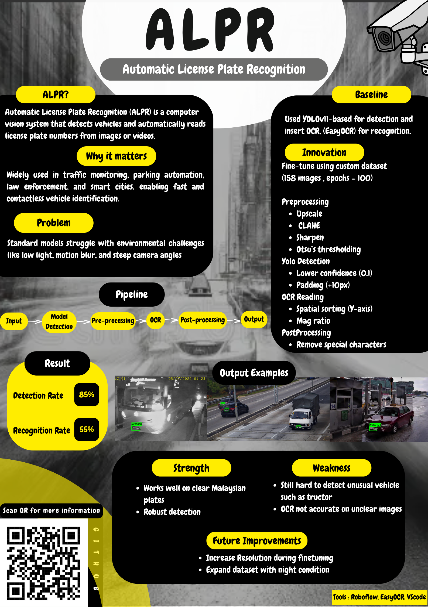

ALPR-MV-PROJECT-
# Automatic License Plate Recognition (ALPR) System
## 1. Project Overview
This project presents a GUI-based Machine Vision ALPR system for Malaysian vehicle license plates. The work focuses on a comparative study between a baseline ALPR pipeline and an optimized ALPR pipeline, highlighting performance improvements in detection robustness and OCR accuracy under real-world conditions such as low illumination, glare, and motion blur.

The baseline system uses EasyOCR’s built-in **CRAFT** text detector and **CRNN** recognizer, while the optimized system integrates a fine-tuned **YOLOv11** detector with an enhanced **EasyOCR** pre-processing pipeline.

## 2. Methodology & Innovation

### **A. System Pipeline**
**Baseline ALPR Pipeline**
`Input` $\rightarrow$ `EasyOCR CRAFT Detection` $\rightarrow$ `CRNN Recognition` $\rightarrow$ `Output`

**Optimized ALPR Pipeline**
`Input` $\rightarrow$ `YOLOv11 Detection` $\rightarrow$ `Pre-processing` $\rightarrow$ `EasyOCR` $\rightarrow$ `Post-Processing` $\rightarrow$ `Output`

### **B. Key Innovations in Optimized ALPR**
1.  **Model Fine-Tuning:**
    * **Base Model:** YOLOv11
    * **Dataset:** Custom dataset of **158 images** (Malaysian plates).
    * **Training:** Trained for **100 epochs** via Roboflow.
    * **Inference Settings:** Confidence Threshold = 0.1.

2.  **Advanced Pre-processing (The "Secret Sauce"):**
    Before OCR reads the text, the plate image undergoes:
    * **Upscaling:** 300% upscale for better clarity.
    * **CLAHE:** Adaptive histogram equalization to fix lighting/glare.
    * **Sharpening:** Enhances character edges.
    * **Otsu's Thresholding:** Converts to binary (black & white) to remove noise.

3.  **Post-Processing:**
    * **Regex Filtering:** Removes special characters, keeping only A-Z and 0-9.
    * **Spatial Sorting:** Reads text in correct Y-axis order.

## 3. Results
* **Detection Rate:** **85%** (Tested on Week 12 Dataset of 100 images).
* **Strengths:** Robust detection on clear Malaysian plates; handles angled views well.
* **Weaknesses:** OCR accuracy drops on extremely grainy night images or unusual vehicles (e.g., trucks).

---

## 4. How to Run (Step-by-Step)

### **Step 1: Prerequisites**
Ensure you have the following files in the same folder:
* `ALPR.py` (The main application code)
* `ALPR.pt` (The YOLOv11 model file)

### **Step 2: Install Libraries**
Open your terminal and run:
```bash
pip install opencv-python easyocr ultralytics numpy pillow
```
### **Step 3: Launch**
Open your terminal and run:
```bash
python ALPR.py
```
1. A GUI window will appear.
2. Click "Select Image Folder".
3. Choose the folder containing your test images.
4. View results live!

## 5.Tools Used
-Frameworks: Python, OpenCV, PyTorch.
-Models: Ultralytics YOLOv11, EasyOCR.
-Training Platform: Roboflow.
-Editor: VS Code.

cat << 'EOF' >> README.md

## 6. Project Poster
You can check our poster below:


EOF


